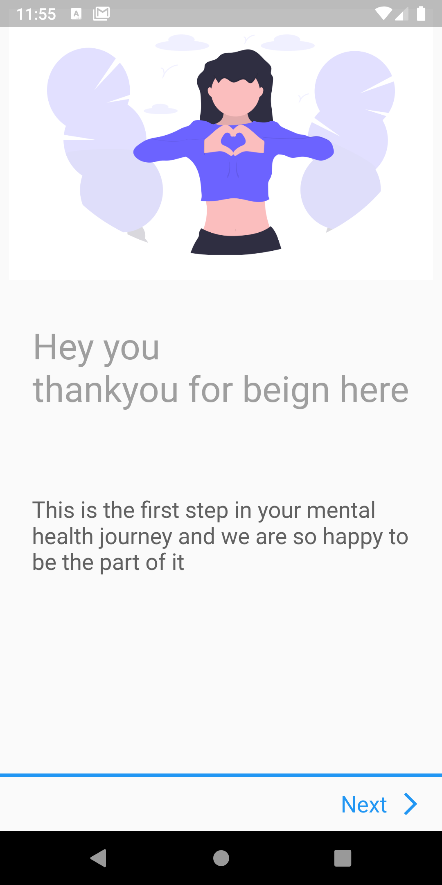
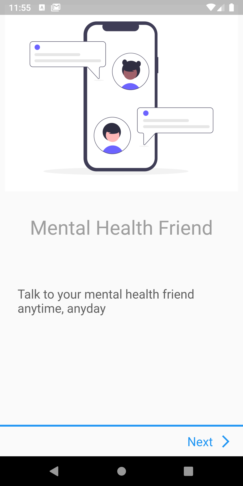
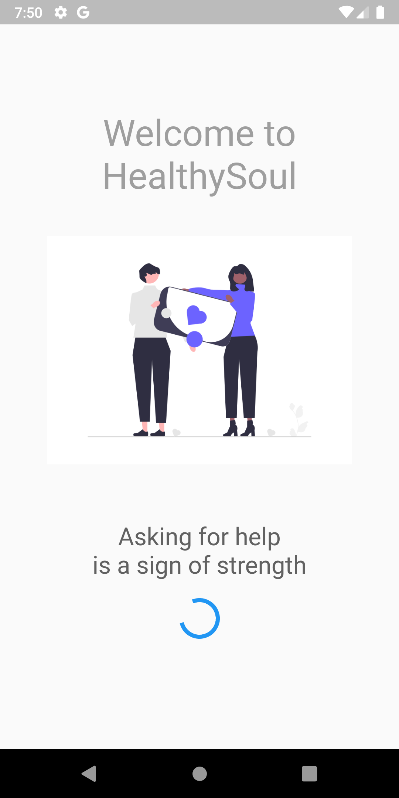
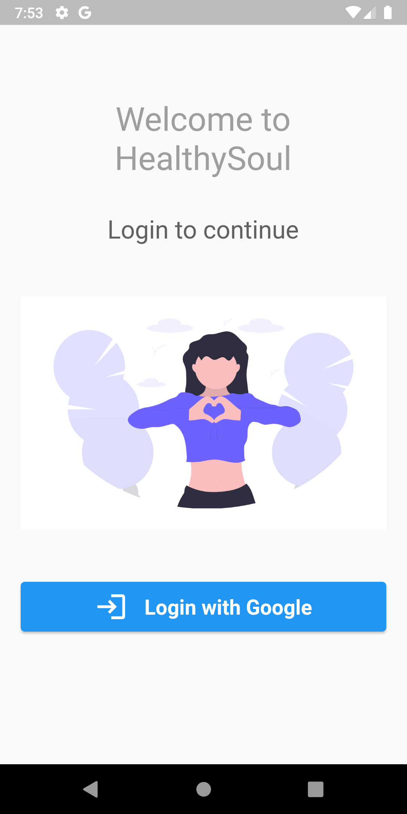
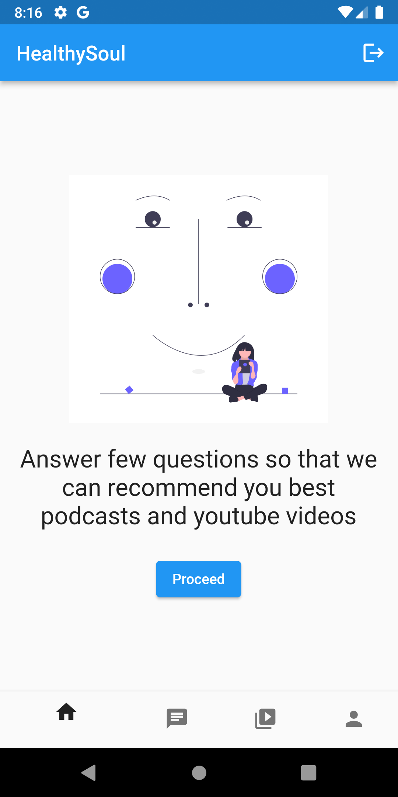
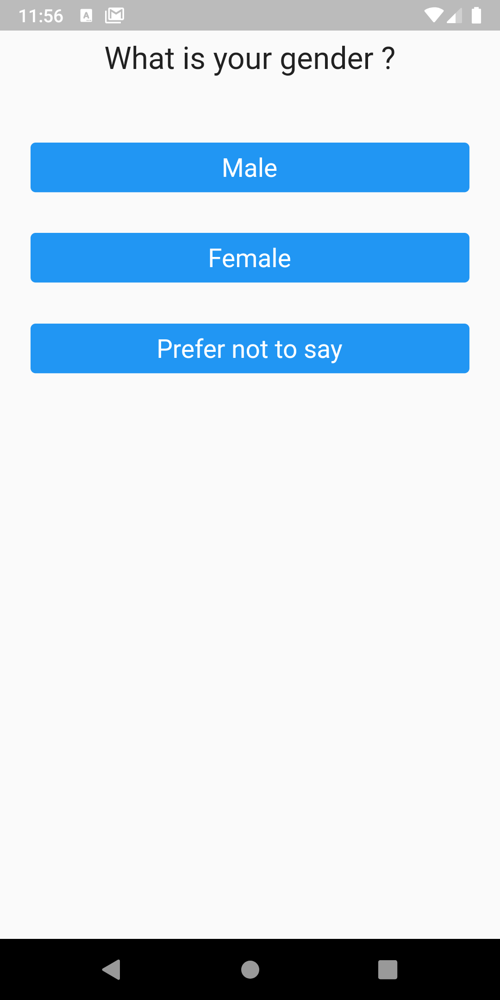
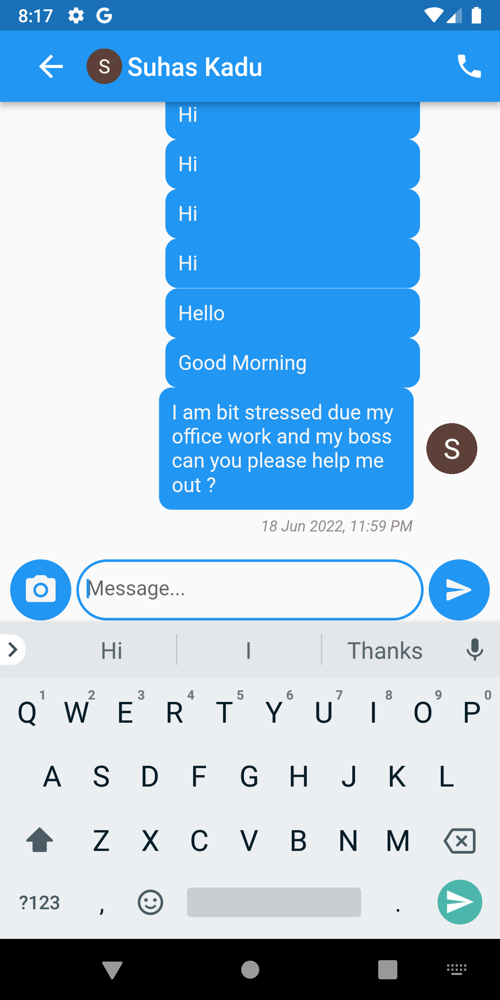
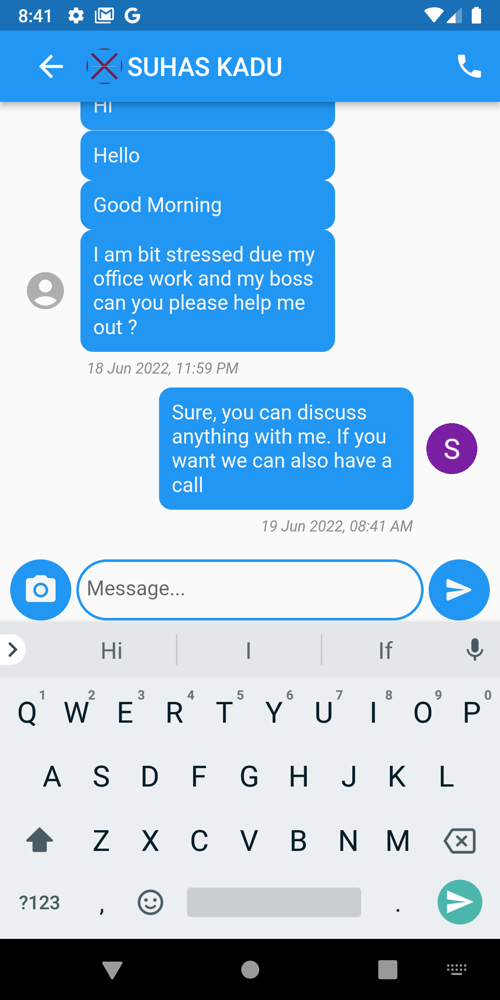
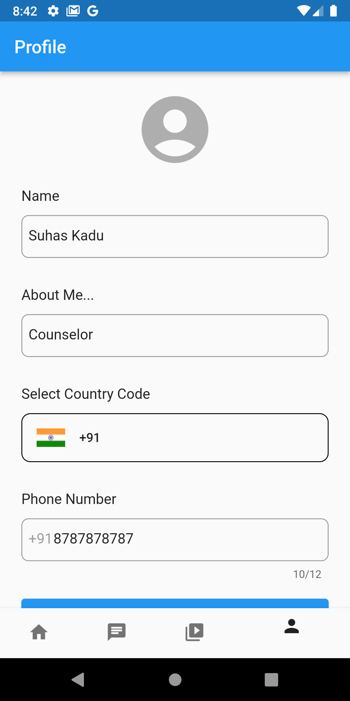

<h1 align="center">HealthySoul</h1>
<h3 align="center"><i>"Be gentle with yourself"</i></h3>

## Inspiration

Among all the forms of psychological and mental disorders, depression is the most common form. Depression can cause severe problems in case of failing to detect it at an early stage or failing to ensure the timely counseling of a depressed person. With the massive advancement of information and technology, the need for using machine learning algorithms in psychological sectors is increasing but currently their use in psychological sectors is relatively low. To screen depression efficiently, demographic and psychosocial factors which play a significant role in forming depression can be used. By analysing these Key factors of depression, we can extract depression levels on a scale.

## What it does

The project consists of two parts: ML model and App. The model asks some questions to users and responses given by user will act as input to the model. Then the model will recommend user several podcasts and videos. Also the app counselor support. Users can discuss their problems with counselors. But unfortunately the integration of ML model and app is under development due to compatibility issues between TFLite and Flutter.

## How I built it

Python, Tensowflow and, Keras are used to build the model and Flutter to build the app. 

## Challenges I ran into

The main challenge was integration of ML model and app due to compatibility issues between TFLite and Flutter. 

## Accomplishments that I'm proud of

I'm proud that I have successfully designed an app which can help users going through mental health issues. The app is deployed using Firebase App Distribution.

## What I learned

I have learned about chat feature, google authentication. 

## What's next for HealthySoul

The first and the foremost thing is integration of ML model. Adding podcasts to the app using Spotify API.

## Code for ML Model
https://www.kaggle.com/suhaskadu1/depression-model 

## Results

  &emsp;    &emsp;  

  &emsp;    &emsp;  

  &emsp;    &emsp;  

  &emsp;  

